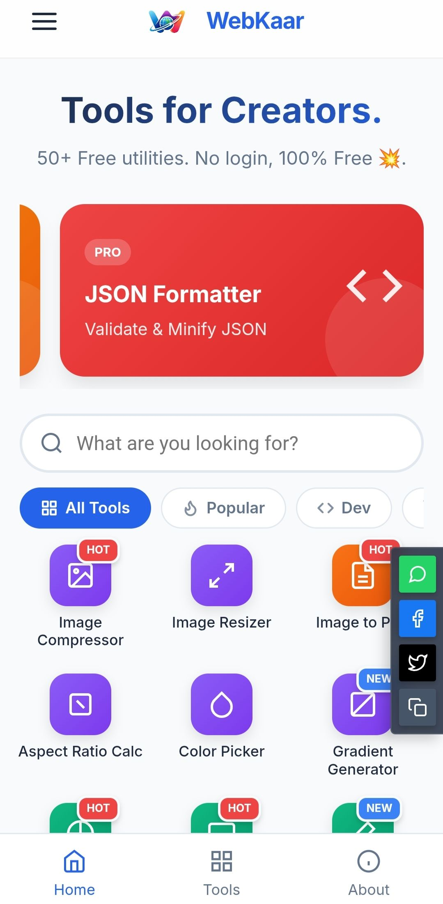
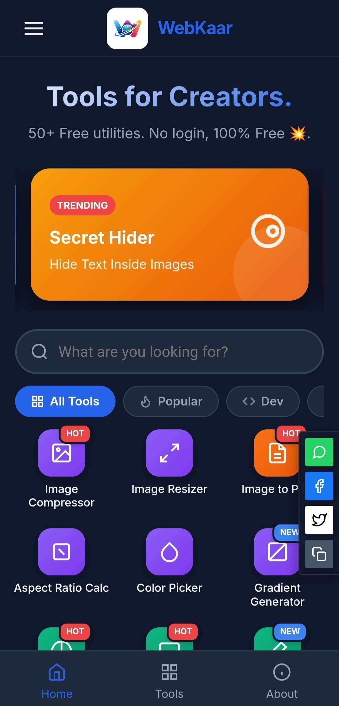

# 🚀 WebKaar - Smart Online Tools


<div align="center">

[]()
[]()
[]()
[]()
[]()

**A professional, native-feeling web application providing essential developer and utility tools.** *Free. Fast. Secure.*

[🔴 Live Demo](https://webkaar.pages.dev/) | [🐞 Report Bug](mailto:ayushofficial2050@gmail.com) | [✨ Request Feature](mailto:ayushofficial2050@gmail.com)

</div>

---

## 📖 About The Project

**WebKaar** is not just another tools website. It is designed to feel like a **Native Mobile App** using modern Web Technologies (HTML, CSS, JS). 

Our goal is to provide a clutter-free, ad-free, and privacy-focused environment where creators and developers can perform tasks like image compression, code formatting, and unit conversion instantly.

### Why WebKaar?
* **📱 Native App Feel:** No page reloads, smooth transitions, and touch-friendly UI.
* **🔒 Privacy First:** All tools (Image Compressor, Converters) process files **locally in your browser**. No data is uploaded to our servers.
* **⚡ Blazing Fast:** Optimized Vanilla JS with no heavy frameworks.
* **🌙 Dark Mode:** Beautiful, battery-saving dark UI.
* **📶 Offline Ready:** Fully functional PWA support.

---

## 🛠️ Tools Available

We currently host **20+ Professional Tools** across various categories:

| 💻 **Developer** | 🎨 **Design & Media** | 🧰 **Utility** |
| :--- | :--- | :--- |
| JSON Formatter | Image Compressor | Password Generator |
| HTML Formatter | Image Resizer | QR Code Generator |
| CSS Minifier | Color Picker | Word Counter |
| Base64 Encoder | Aspect Ratio Calc | Unit Converter |
| UUID Generator | Image to PDF | Text Diff Checker |

---

## 📸 Screenshots

| Light Mode | Dark Mode |
|:---:|:---:|
|  |  |

> *Note: Open the app on mobile for the best experience.*

---

## 🚀 Tech Stack

* **Frontend:** HTML5, CSS3 (Variables, Flexbox/Grid)
* **Logic:** Vanilla JavaScript (ES6+ Modules)
* **PWA:** Service Workers, Web Manifest
* **Icons:** Inline SVG & Phosphor Icons logic
* **Hosting:** cloudfare

---

## 📂 Folder Structure

```text
WebKaar/
├── css/
│   ├── style.css          # Core variables & layout
│   └── responsive.css     # Mobile adaptations
├── js/
│   ├── main.js            # UI Logic (Search, Tabs, Theme)
│   └── api.js             # Data Fetching & API handling
├── images/                # Logos, Icons, OG Images
├── pages/                 # Static pages (About, Privacy)
├── tools/                 # Individual Tool Folders
│   ├── image-compressor/
│   ├── json-formatter/
│   └── ...
├── index.html             # Main Entry Point
├── manifest.json          # PWA Config
├── service-worker.js      # Offline Support
└── README.md              # Documentation